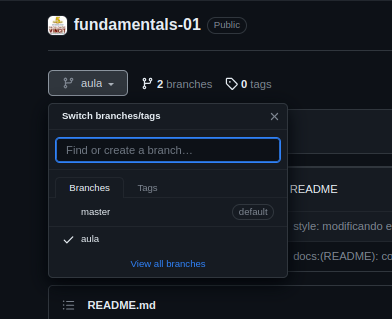

# Fundamentos do Desenvolvimento Web

### Sumário
1. [Descrição](#descrição)
    - [Sobre este repositório](#sobre-este-repositório)
    - [Habilidades a serem desenvolvidas](#habilidades-a-serem-desenvolvidas)
2. [Como utilizar este repositório](#como-utilizar-este-repositório)

## Descrição

### Sobre Este Repositório

Neste repositório serão colocados todos os códigos feitos ao vivo nas aulas de **_Fundamentos do Desenvolvimento Web_**.  
Nós desenvolveremos projetos na medida que avançarmos em nossos conhecimentos sempre buscando reforçar o que já foi aprendido e praticar o que se aprendeu.

### O que será estudado

Dentro dos estudos de _Fundamentos_ nós veremos as seguintes tecnologias:

- Git e GitHub
- HTML5
- CSS3
- JavaScript(ES6)
- Jest

### Habilidades a serem desenvolvidas

Nós desenvolveremos a habilidade de criar _sites_ e _aplicações web_ responsivos interativos e que sejam capazes de se comunicar com APIs gerando grande valor e tornando nossas aplicações em poderosas ferramentas também.  
Nós aprenderemos:

- Construir páginas utilizando TAGs HTML
- Estilizar elementos HTML
- Posicionar elementos HTML
- Adicionar responsividade às páginas HTML
- Manipular elementos HTML através de JavaScript (DOM)
- Consumir APIs
- Testar aplicações web utilizando Jest (Testes unitários)

### Como utilizar este repositório

Os conteúdos estarão organizados em _branches_ onde cada branch será dedicada à uma tecnologia HTML5, CSS3, etc. Na branch principal estará apenas a descrição do repositório Navegue pelas branches do repositório para acessar o conteúdo pretendido.

 

#### Repositório de Exemplo:

 

#### Exemplo de branches:

> Na imagem acima temos um exemplo de branches que teremos. Ao selecionar uma branch você verá os conteúdos referentes à tal branch.
